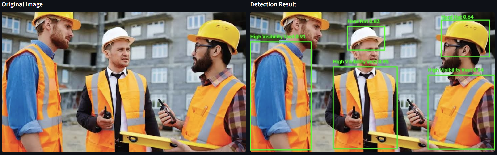
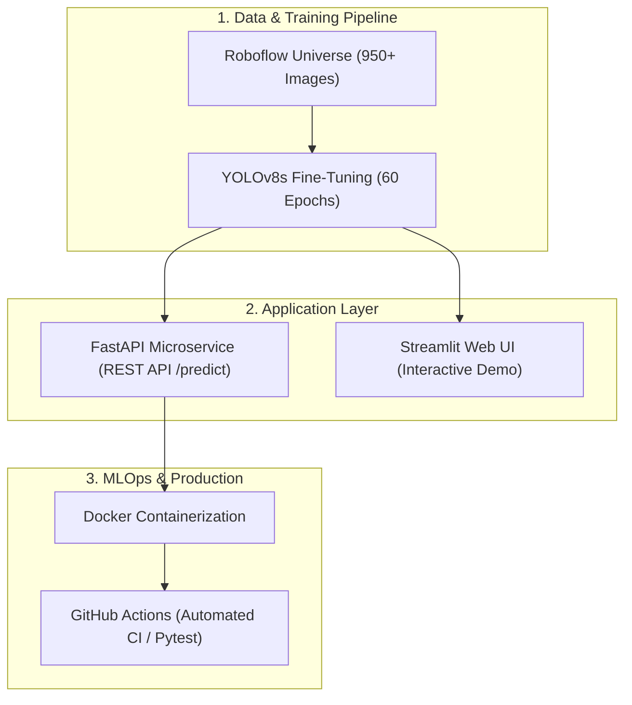

# 🦺 Real-Time Construction Safety & PPE Violation Detection (MLOps)

[](https://github.com/kimkimono8/Real-time-Construction-Safety-Detection/actions/workflows/ci.yml)


ระบบคอมพิวเตอร์วิทัศน์ตรวจจับการสวมใส่อุปกรณ์คุ้มครองความปลอดภัยส่วนบุคคล (PPE) และแจ้งเตือนการละเมิดกฎความปลอดภัย (Violation Detection) ในไซต์งานก่อสร้างแบบ Real-Time พร้อมสถาปัตยกรรม MLOps ครบวงจรตั้งแต่ Data Pipeline, Model Training, REST API Microservice, Web UI, Containerization และ Automated CI Pipeline

---

## 📸 Demo & Visualization



ระบบมีตรรกะประเมินความปลอดภัย (Compliance Engine) แยกตามอุปกรณ์และการละเมิด:
* 🟢 **COMPLIANT:** สวมใส่อุปกรณ์ครบถ้วน (`helmet`, `vest`, `glove`, `goggles`)
* 🔴 **NON-COMPLIANT:** ตรวจพบการละเมิดความปลอดภัย (`no_helmet`, `no_vest`, `no_glove`, `no_goggles`)

---

## 📊 Model Evaluation & Benchmarks

โมเดลได้รับการ Fine-tune บนสถาปัตยกรรม **YOLOv8s (11.1M Parameters)** จำนวน 60 Epochs ประเมินผลบน Validation Set ขนาดใหญ่ (**953 ภาพ / 1,951 วัตถุ**):

| Class | Instances | Precision | Recall | mAP50 | mAP50-95 |
| :--- | :---: | :---: | :---: | :---: | :---: |
| **All Classes** | **1,951** | **55.5%** | **56.2%** | **55.1%** | **30.2%** |
| **Helmet** | 240 | 80.4% | 85.5% | **90.3%** | 70.2% |
| **Vest** | 150 | 56.2% | 60.0% | **60.9%** | 36.6% |
| **No Helmet (Violation)** | 263 | 60.8% | 62.4% | **58.4%** | 24.3% |
| **No Vest (Violation)** | 350 | 55.4% | 62.6% | **51.1%** | 22.0% |
| **Glove** | 460 | 55.8% | 62.0% | **61.5%** | 31.6% |

---

## 🏗️ System Architecture



---

## 🚀 Quick Start

### 1. ใช้งานผ่าน Docker (Microservice)
```bash
# Build Docker Image
docker build -t ppe-detection-api:v1 .

# รัน Container (Host Port 8001 -> Container Port 8000)
docker run -d -p 8001:8000 --name ppe-api ppe-detection-api:v1
```
* Interactive API Documentation (Swagger UI): `http://localhost:8001/docs`

### 2. รัน Interactive Web Dashboard (Streamlit)
```bash
streamlit run streamlit_app.py
```
* เข้าใช้งานหน้าเว็บที่: `http://localhost:8501`

### 3. รันการทดสอบ Unit Tests
```bash
python -m pytest tests/
```

---

## 📂 Project Structure

```text
├── .github/workflows/       # GitHub Actions CI/CD Pipeline
├── app/                     # FastAPI Backend Service
│   ├── __init__.py
│   ├── main.py              # API Endpoints (/health, /predict)
│   └── schemas.py           # Pydantic Schemas
├── configs/                 # Configuration Files
├── data/                    # Dataset Pipeline artifacts (.gitkeep)
├── docs/assets/             # Project demo media (demo.png)
├── models/                  # Custom trained YOLO weights (.gitkeep)
├── src/                     # Core Business & Computer Vision Logic
│   ├── data_loader.py       # Roboflow Dataset Ingestion
│   ├── detector.py          # PPE Compliance & Inference Pipeline
│   └── train.py             # YOLOv8 Training Script
├── tests/                   # Automated Unit Tests
├── streamlit_app.py         # Streamlit Web Application
├── Dockerfile               # Production Container Definition
├── requirements.txt         # Project Dependencies
└── README.md                # Project Documentation
```
